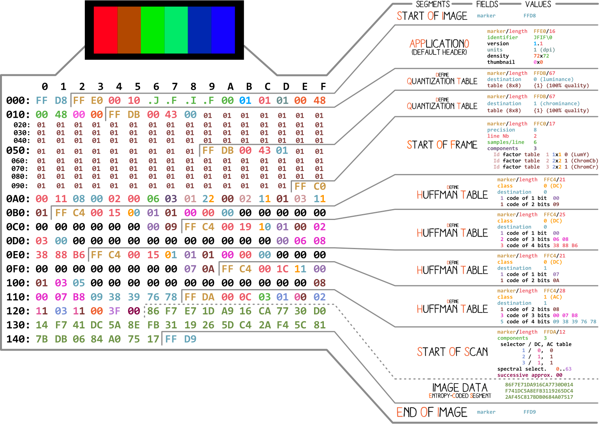
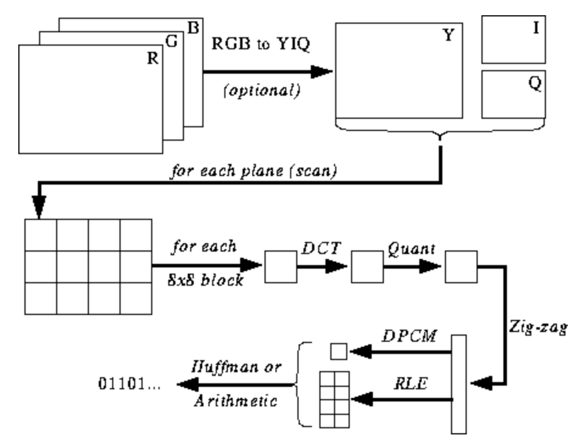
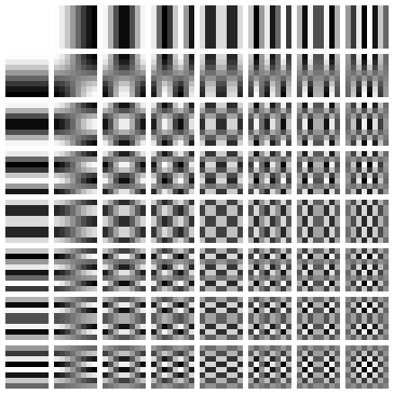

THIS HANDS-ON BASED ON [Understanding and Decoding a JPEG Image using Python](https://yasoob.me/posts/understanding-and-writing-jpeg-decoder-in-python).  
You can check origin code in [yasoob/Baseline-JPEG-Decoder](https://github.com/yasoob/Baseline-JPEG-Decoder).

# JPEG 압축과 디코딩 원리

JPEG는 단순히 이미지 포맷일 뿐만 아니라, 압축 알고리즘명이기도 하다.
우리가 접하는 대부분의 JPEG 이미지는 JFIF(JPEG File Interchangable Format) 포맷인데, 이 포맷은 내부적으로 JPEG 압축 알고리즘을 사용한다.

from [Ange Albertini](https://twitter.com/angealbertini)  

기본적으로 모든 binary 파일들은 Marker 혹은 Header를 가지는데, 북마크처럼 생각하면 된다.
프로그램이 파일을 읽을때 파일의 어떤 내용이 어느 위치에 저장되어있는지 알려준다.
대부분의 marker는 해당 marker 세그먼트의 length 정보를 들고 있다. 해당 세그먼트가 어느정도 길이인지 알려주는 정보이다.  

`FFD8`과 `FFD9`, `FF01`을 제외하고 나머지 모든 마커는 마커 세그먼트의 길이가 따라붙는다. 
이미지 파일의 시작과 끝은 항상 2바이트 길이다.

## 인코딩 프로세스

from https://users.cs.cf.ac.uk/Dave.Marshall/Multimedia/node234.html

### JPEG Color Space

[ISO/IEC 10918-6:2013(E), Section 6.1](https://www.itu.int/rec/T-REC-T.872-201206-I/en)에 따르면, JPEG 스펙은 다음과 같다.
- 1개의 컴포넌트로 인코딩된 이미지는 0(black)-255(white)의 grayscale로 간주한다.
- 3개의 컴포넌트로 인코딩된 이미지는 YCbCR로 인코딩된 RGB데이터로 간주한다. 단 이미지가 APP14 마커를 가지고 있는 경우는 마커 데이터에 따라 RGB 혹은 YCbCr 둘 중 하나로 간주 할 수 있다.
- 4개의 컴포넌트로 인코딩된 이미지는 APP14 마커를 가지고 있지 않은 이상 CMYK로 간주한다. APP 14 마커를 가지고 있는 경우는 마커 데이터에 따라 CMYK 혹은 YCCK 둘 중 하나로 간주할 수 있다.

대부분의 JPEG 알고리즘 구현은 RGB 대신 휘도(luminance)와 크로마(chrominance, 동휘도의 참조색과의 색차-color difference-를 의미, YUV 인코딩)를 사용한다.
인간의 눈은 작은 영역의 고주파(high-frequency) 밝기 변화를 잘 감지하지 못하는데, 그래서 주파수를 낮추어 이미지를 압축하더라도 화질에는 별 차이가 없어보이게 된다. JPEG는 이러한 원리를 사용한다.

RGB에서 한 픽셀이 Red, Green, Blue의 3바이트 색상 데이터로 이루어져 있듯, YUV의 한 픽셀도 3바이트로 이루어져있지만 각 바이트가 의미하는 바는 조금 다르다.
Y는 밝기를 결정하는 휘도(luminance, luma), U와 V는 색상을 결정하는 색차(chroma)이다. U는 Blue와의 색차, V는 Red와의 색차를 의미한다.

YUV 포맷은 컬러 텔레비젼이 보편화되지 않았을 때 나왔는데, 기존의 흑백 영상과 컬러 영상을 모두 하나의 포맷으로 처리할 수 있게 호환성을 가지도록 개발되었다.

### 코사인 변환 & 양자화(Quantization)

JPEG는 이미지를 MCU(Minimum Coding Units)이라 불리는 8x8 픽셀 블록 덩어리로 변환한다.
이 때 0을 중앙으로 하여 픽셀 값의 범위를 조정하고 이산 코사인 변환(Discrete Cosine Transformation)을 각 블록에 취한 뒤, 결과를 *양자화(quantization)하여 압축한다.
* 양자화 : 연속된 아날로그 수치를 띄엄띄엄 떨어진 디지털 수치로 변환하는 작업

DCT(이산 코사인 변환)는 이산 데이터를 코사인 wave의 조합으로 바꾸는 방식인데, 8x8 이미지 블록을 8x8 코사인함수 행렬을 이용하여 복원한다.  
8x8 코사인함수 행렬의 형태는 아래와 같다.

DCT를 픽셀의 각 컴포넌트마다 적용하면, (8x8 총 64개의) 각 코사인 함수가 입력 행렬(8x8)에 얼마나 영향을 주었는지 8x8 첨가행렬(coefficient matrix)로 얻어낼 수 있다.
첨가행렬은 일반적으로 가장 낮은 frequency의 값을 좌상단에, 높은 frequency의 값을 우하단에 표현한다.  

이러한 첨가행렬을 살펴보면, 대부분의 이미지들이 저주파의 정보들을 많이 가지고 있으며 고주파의 정보들은 적게 가지고 있다는 것을 확인할 수 있다.
만약 첨가행렬의 우하단, 즉 고주파의 정보들을 0으로 바꾼다면 어떻게 될까? 위에서 언급했듯이 인간의 눈은 고주파의 밝기 변화를 잘 감지하지 못하므로, 이미지에는 별 차이가 없는것처럼 느껴진다.
따라서 (육안상) 별다른 정보 손실 없이도 고주파 데이터를 제거할 수 있는 것이다.

위의 글이 이해가 되지 않는다면 다음 영상을 확인해보자.
- [JPEG DCT, Discrete Cosine Transform](https://www.youtube.com/watch?v=Q2aEzeMDHMA)

JPEG는 손실이 있는 압축 알고리즘이라고들 하지만, 지금까지는 손실된 정보가 없다. 첨가행렬의 고주파 정보들을 제거하기 전까지는, 단순히 8x8 YUV 컴포넌트를 8x8 코사인 함수 블록으로 정보의 손실 없이 변환시켰을 뿐이다.
**실제 손실은 이 부분이 아니라, 그 이후에 진행되는 양자화 부분에서 일어난다.**

이미지를 JPEG 형태로 저장할 때면, 대부분의 이미지 에디터는 압축률 퍼센티지를 입력받는다. 이 압축률은 얼마나 양자화를 할 것인지, 또 고주파 정보를 얼마만큼 손실할 것인지를 결정하는 요인이 된다.
만약 JPEG로 저장함으로써 압축이 되어 이러한 고주파 정보를 한번 손실하고 나면, 다시는 원본 이미지를 그대로 복원할 수 없다.

